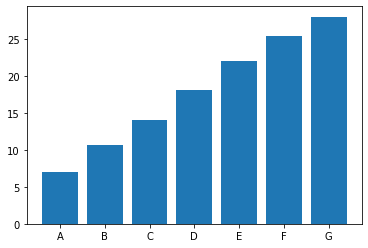
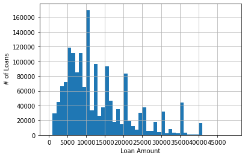

## Loan Data
For this project, we'll use lending club loan data, which is available from [https://www.kaggle.com/wendykan/lending-club-loan-data/data](Kaggle).  The data set contains information on about 2 million loans - which includes information about the loan recipient (i.e. their risk profile (grade) and home ownership status), the loan (amount, issue date), and outcome (paid, current, default). The data set is distributed as an SQLite database, **and** a CSV file - which makes it a good way to start comparing how data formats make a difference.

The data is available via `dvc` - there is no need to create a Kaggle account to download - but I do suggest you check Kaggle out - there are tons of data sets!

```
dvc pull
```
The two files you'll recieve are `loans.csv` and `database.sqlite`.  They contain exactly the same data - just stored differently.  They are each about 1 GB - and the first comparison you might make is that in terms of space, there isn't much difference.

## Analysis
Try answering / implementing the following analysis questions in two ways:
1. Loading the loans.csv file into `pandas` and use `pandas` to answer the questions
2. Utilize the SQLite file instead, and work with SQL.

I am only going to describe the SQLite part here - we've already gone over `pandas`, and this is a great opportunity to review your knowledge.

### Step 1 - Explore
CSV files are easy to explore - you just open them!  When those CSV files get really big, that isn't all that convenient though.  Start out by creating an SQLite connection to the database file.  

```python
import sqlite3
conn = sqlite3.connect('database.sqlite')
```
You can see what tables (table) is there by executing `"SELECT name FROM sqlite_master WHERE type='table';"`.  All your accesses will be to this table.

### Question 1:  What are the different loan status values?
Using SQL, select the `distinct` values of the `loan_status` column to see what options there are.

### Question 2:  What time period is being recorded?
The `issued_d` column has a very inconveniently formatted time stamp - in the format of Sep-2020.  Note that you can't just sort the issue dates to see the max and min, since it's not a sortable date format.  To find the max/min, you'll need to convert the date strings into `datetime` objects.  Take a look at `datetime`'s `strptime` method.  Once you have a list of dates, the built-in python `min` and `max` functions will give you the answers.

### Question 3:
What is the average salary (`annual_inc`) of loans given to homeowners (`home_ownership == MORTGAGE`)?  What about renters?

### Question 4 - Loan Default Rates:
What is the loan default rate for homeowners versus renters?  Treat a loan whose status is either 'Default' or 'Charged Off` as being in "default".  Does the percentage make sense?

### Question 5 - Grade vs. Interest Rates
The `grade` column ranks loan applicants from A to G - with A representing the safest loans, and G being the highest risk.  Use SQL `group by` to compute the average interest rate among each group, only for 36 month loans (`term`).  *Hint, there is some data cleaning to do here...*.

As a next step - **plot the data** as a bar graph using matplotlib.  You should get the following:



### Question 6 - Distribution of loan amounts
Create a *histogram* using matplotlib's `hist` function of the loan amounts for 36 month loans.  Do a little exploration first - finding the minimum and maximum loan amounts, so your bins are reasonable.  You should end up with something like this:



## Comparing SQL to Pandas
Make sure you work through solving these questions with `pandas` too.  Putting familiarity aside - which did you like better?  

Things to think about:
1. What was easier from a programming standpoint?
2. What was faster in terms of speed of computation?
3. What was more efficient, in terms of memory usage?